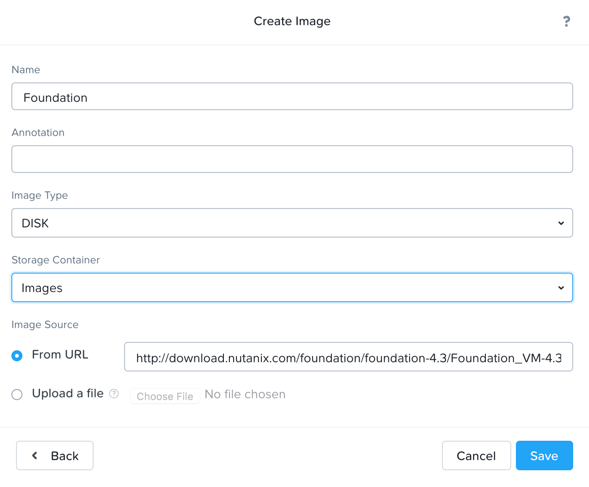
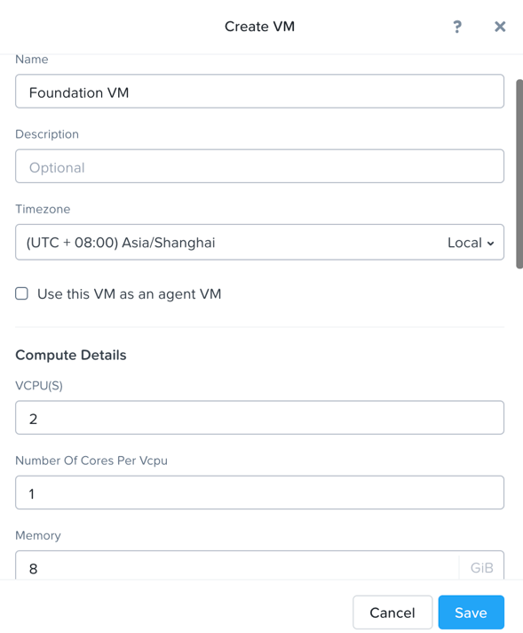
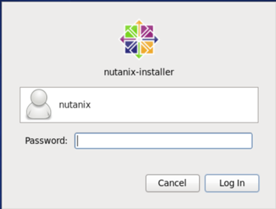
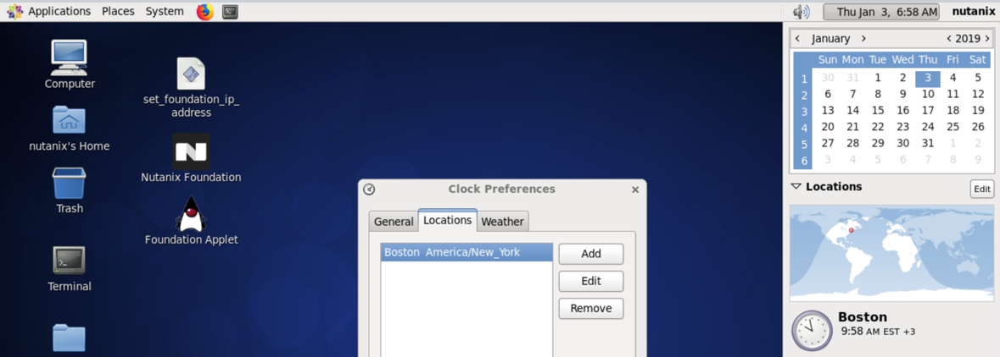
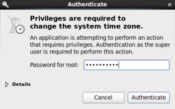
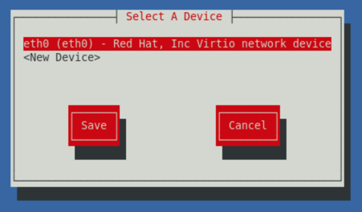
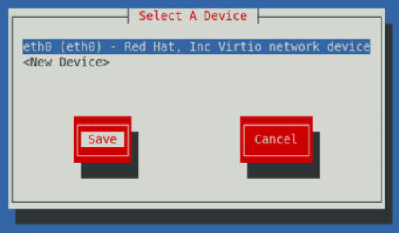
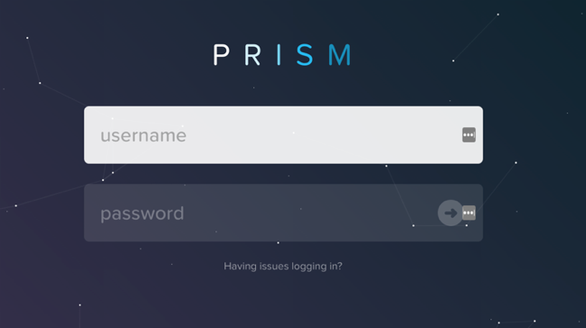

.. _diyfoundation:

---------------------
Foundation a cluster
---------------------

Overview
++++++++

.. note::

  Estimated time to complete: **90 Minutes**

Foundation is used to automate the installation of the hypervisor and Controller VM on one or more nodes. 
In this exercise you will practice imaging a physical cluster with Foundation. In order to keep the lab self-contained, you will create a single node "cluster" on which you will deploy your Foundation VM. That Foundation instance will be used to image and create a cluster from the remaining 3 nodes in the Block.

IPs for Nodes
..............

+---------+---------------+----------------+---------------+
|Node	  |IPMI IP        |Hypervisor IP   |CVM IP         |
+=========+===============+================+===============+
| A       |10.21.xx.33	  |10.21.xx.25     |10.21.xx.29    |
+---------+---------------+----------------+---------------+
|B        |10.21.xx.34	  |10.21.xx.26     |10.21.xx.30    |
+---------+---------------+----------------+---------------+
|C        |10.21.xx.35	  |10.21.xx.27     |10.21.xx.31    |
+---------+---------------+----------------+---------------+
|D        |10.21.xx.36	  |10.21.xx.28     |10.21.xx.32    |
+---------+---------------+----------------+---------------+

* IPMI User:ADMIN, Password:ADMIN
* In following steps, you may replace xx with your assigned cluster ID

Cluster Details
................

Using the spreadsheet below, locate your **Group Number** and corresponding details for your group's assigned cluster.

.. raw:: html

  <iframe src=https://docs.google.com/spreadsheets/d/1JAXYpRsNkzYUys_Sny4jRUtY8AeJymqMVEPwY_si3yo/edit#gid=847779028gid=0&amp; single=false&amp;widget=false&amp;chrome=false&amp;headers=false&amp;range=a1:m41 style="position: relative; height: 500px; width: 100%; border: none"></iframe>

DIY Your Environment
++++++++++++++++++++++++

A Hosted POC reservation provides a fully imaged cluster consisting of 4 nodes. To keep the lab self-contained within a single, physical block, you will:

- Destroy the existing cluster
- Create a single node "cluster" using Node D
- Install the Foundation VM on Node D
- Use Foundation to image Nodes A, B, and C and create a 3 node cluster

Using an SSH client, connect to the **Node A CVM IP** <10.21.xx.29> in your assigned block using the following credentials:

- **Username** - nutanix
- **Password** - *techX2019!*

Execute the following commands to power off any running VMs on the cluster, stop cluster services, and destroy the existing cluster:

.. code-block:: bash

  acli -y vm.off \*
  cluster stop        # Enter 'Y' when prompted to proceed
  cluster destroy     # Enter 'Y' when prompted to proceed

Create Node D Cluster 
+++++++++++++++++++++

Remaining in SSH client, access Node-D CVM and execute following commands

.. code-block:: bash

 ssh nutanix@10.21.xx.32
 cluster -s 10.21.xx.32 create       # Enter 'Y' when prompted to proceed

 ncli cluster edit-params new-name=POCxx-D
 ncli cluster add-to-name-servers servers=10.21.253.10
 ncli cluster set-external-ip-address external-ip-address=10.21.xx.40
 ncli user reset-password user-name='admin' password=techX2019! 

.. note::

  The above command will create a "cluster" from a single node using RF1, offering no redundancy to recover from hardware failure. This configuration is being used for non-production, instructional purposes and should **NEVER** be used for a customer deployment.

  After the "cluster" is created, Prism will reflect Critical Health status due to lack of redundancy.

Install Foundation VM 
++++++++++++++++++++++

Open \https://*<Node D CVM IP>*:9440 (\https://10.21.xx.32:9440) in your browser and log in with the following credentials:

- **Username** - admin
- **Password** - techX2019!

Accept the EULA and Pulse prompts.

In **Prism > Storage > Table > Storage Pool**, select default storage pool and click update, then rename it to *SP01*

Click **+ Storage Container** to create a new container named *Images*

.. image:: images/image001.png

Go to configuration page and navigate to **Image Configuration**, click **+Upload Image**
Fill out the following fields and click **Save**:

- **Name** - Foundation
- **Image Type** - Disk
- **Storage Container** Images
- Select **From URL**
- **Image Source** - http://download.nutanix.com/foundation/foundation-4.3/Foundation_VM-4.3-disk-0.qcow2

   
   
.. note::

  At the time of writing, Foundation 4.3 is the latest available version. The URL for the latest Foundation VM QCOW2 image can be downloaded from the `Nutanix Portal <https://portal.nutanix.com/#/page/foundation>`_.

  **Unless otherwise directed by support, always use the latest version of Foundation.**
  

After the image creation process completes, browse to **Prism > VM > Table** and click **Network Config**.

Before creating the VM, we must first create a virtual network to assign to the Foundation VM. The network will use the Native VLAN assigned to the physical uplinks for all 4 nodes in the block.

Click **Virtual Networks > Create Network**.

Fill out the following fields and click **Save**:

- **Name** - Rx-Automation-Network
- **VLAD ID** - 0

In **Prism > VM > Table** and click **+ Create VM**.

Fill out the following fields and click **Save**:

- **Name** - Foundation
- **vCPU(s)** - 2
- **Number of Cores per vCPU** - 1
- **Memory** - 8 GiB
- Select **+ Add New Disk**

  - **Operation** - Clone from Image Service
  - **Image** - Foundation
  - Select **Add**
- Select **Add New NIC**

  - **VLAN Name** - Rx-Automation-Network
  - Select **Add**

 

.. image:: images/image004.png

   
Config Foundation VM
+++++++++++++++++++++

Select your **Foundation** VM and click **Power on**.

Once the VM has started, click **Launch Console**.

Once the VM has finished booting, click **nutanix**. Enter the default password *nutanix/4u* click **Log In**.

   
Click the time on top right, change the time zone of the Foundation VM to local time zone with User: root, Password: nutanix/4u

  
   

   
Double-click **set_foundation_ip_address > Run in Terminal**.

Select **Device configuration** and press **Return**.

.. image:: images/image009.png
 
   
Select **eth0** and press **Return**.

 
   
.. note:: Use the arrow keys to navigate between menu items.

Replacing the octet(s) that correspond to your HPOC network, fill out the following fields, select **OK** and press **Return**:

- **Use DHCP** - Press **Space** to de-select
- **Static IP** - 10.21.xx.45 (Foundation VM IP)
- **Netmask** - 255.255.255.128
- **Gateway** - 10.21.xx.1

   
.. note::

  The Foundation VM IP address should be in the same subnet as the target IP range for the CVM/hypervisor of the nodes being imaged. As Foundation is typically performed on a flat switch and not on a production network, the Foundation IP can generally be any IP in the target subnet that doesn't conflict with the CVM/hypervisor/IPMI IP of a targeted node.

Select **Save** and press **Return**.

  
   
Select **Save & Quit** and press **Return**.

   
   
Foundation Node ABC cluster
++++++++++++++++++++++++++++

By default, Foundation does not have any AOS or hypervisor images. You can download your desired AOS package from the `Nutanix Portal <https://portal.nutanix.com/#/page/releases/nosDetails>`_.

If downloading the AOS package within the Foundation VM, the .tar.gz package can also be moved to ~/foundation/nos rather than uploaded to Foundation through the web UI. 
  
To shorten the lab time, we use command line to access foundation VM and download NOS binary to designated folder in it.
  
Open a terminal and ssh to foundation VM through foundation IP <10.21.xx.45>
  
.. code-block:: bash

 ssh nutanix@10.21.xx.45      # provide default password of foundation VM : *nutanix/4u*
 cd foundation
 cd nos
 wget  https://s3.amazonaws.com/ntnx-portal/releases/euphrates-5.8.2-stable/nutanix_installer_package-release-euphrates-5.8.2-stable.tar.gz
 
 

 
 
When you see above result, AOS 5.8.2 package has been downloaded to ~/foundation/nos folder.

From within the Foundation VM console, launch **Nutanix Foundation** from the desktop.

.. note::

 Foundation can be accessed via any browser at \http://*<Foundation VM IP>*:8000/gui/index.html

On the **Start** page, click **Next**.

- **network** – eth0
- **Select your hardware platform**: Autodetect
- **Netmask of Every Hypervisor and CVM** - 255.255.255.128
- **Gateway of Every IPMI** - 10.21.xx.1
- **Netmask of Every IPMI** - 255.255.255.128
- **Gateway of Every Hypervisor and CVM** - 10.21.xx.1

   
Click **Click here** to manually specify the MAC address of your assigned node.

.. note::

 Foundation will automatically discover any hosts in the same IPv6 Link Local broadcast domain that is not already part of a cluster. 

 When transferring POC assets in the field, it's not uncommon to receive a cluster that wasn't properly destroyed at the conclusion of the previous POC. In that case, the nodes are already part of existing clusters and will not be discovered. 
  
  In this lab, we choose manually specify the MAC address instead in order to practice as the real world.

.. note::
 
 There are at least 2 methods to know MAC address remotely.

 Method.1 Identify MAC Address (BMC MAC address) of Nodes (A, B, C) by accessing IPMI IP for each node
  
 Method.2 Identify MAC Address of Nodes (A, B, C) by login AHV host with User: root, Password: nutanix/4u for each node
  

Access Node A IPMI through IP 10.21.xx.33 and ADMIN/ADMIN

.. image:: images/image101.png

Record your NODE A BMC MAC address ( in above example , it is **ac:1f:6b:1e:95:eb** )

Doing the same with your other 2 nodes, and record all 3 BMC MAC address.

In previous foundation page, clear all auto discovered nodes and click **add nodes manually**

Fill in block information, choose **I will provide the IPMIs' MACs** and click **Add**

Selecting NODE, click **Range Autofill** in drop-down list of **Tools**, replacing the octet(s) that correspond to your HPOC network, fill out the following fields and select **Next**:

- **IPMI MAC** - the three your just recorded down
- **IPMI IP** - 10.21.xx.33
- **Hypervisor IP** - 10.21.xx.25
- **CVM IP** - 10.21.xx.29
- **Node A Hypervisor Hostname** – POCxx-1

Replacing the octet(s) that correspond to your HPOC network, fill out the following fields and select **Next**:

Fill out the following fields and click **Next**:

- **Cluster Name** - POCxx-ABC
- **Timezone of Every Hypervisor and CVM** - *your local timezone*
- **Cluster Redundancy Factor** - 2
- **Cluster Virtual IP** - 10.21.xx.37

  *Cluster Virtual IP needs to be within the same subnet as the CVM/hypervisor.*

- **NTP Servers of Every Hypervisor and CVM** - 10.21.253.10
- **DNS Servers of Every Hypervisor and CVM** - 10.21.253.10

  *DNS and NTP servers should be captured as part of install planning with the customer.*

- **vRAM Allocation for Every CVM, in Gigabytes** - 32

  *Refer to AOS Release Notes > Controller VM Memory Configurations for guidance on CVM Memory Allocation.*

  
   

   

To upload AOS or hypervisor files, click **Manage AOS Files**.

  
  
   Click **+ Add > Choose File**. Select your downloaded *nutanix_installer_package-release-\*.tar.gz* file and click **Upload**.

After the upload completes, click **Close**. Click **Next**.

Since we have already upload our desired AOS through command line, just select it and click **Next**

     

Fill out the following fields and click **Next**:

- **Select a hypervisor installer** - AHV, AHV installer bundled inside the AOS installer

.. image:: images/image020.png
   
   
.. note::

  Every AOS release contains a version of AHV bundled with that release.

Select **Fill with Nutanix defaults** from the **Tools** dropdown menu to populate the credentials used to access IPMI on each node.

 
 
Click **Start > Proceed** and continue to monitor Foundation progress through the Foundation web console. Click the **Log** link to view the realtime log output from your node.

  
  
When all CVMs are ready, Foundation initiates the cluster creation process.

Open \https://*<Cluster Virtual IP>*:9440 in your browser and log in with the following credentials:

- **Username** - admin
- **Password** - Nutanix/4u
- **Change the Password** - techX2019!

 
