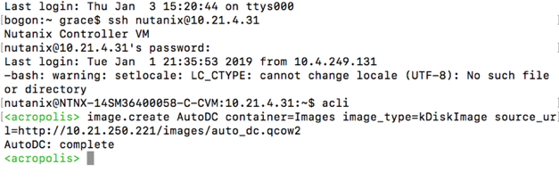
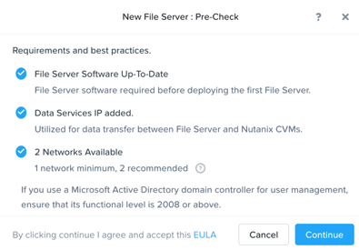
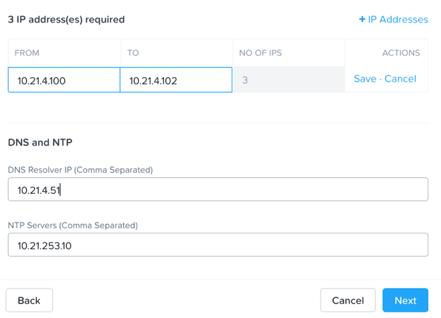
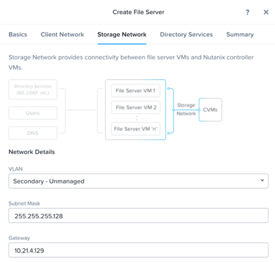
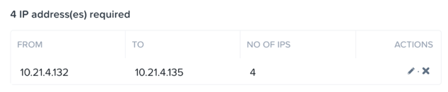
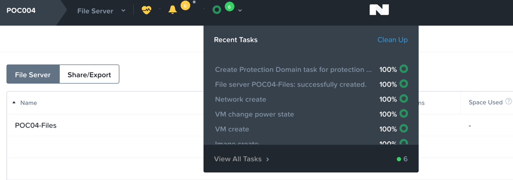
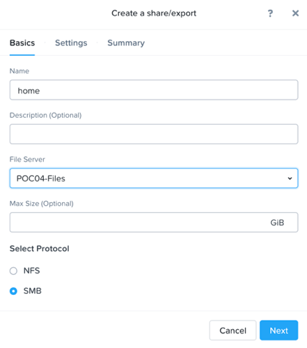
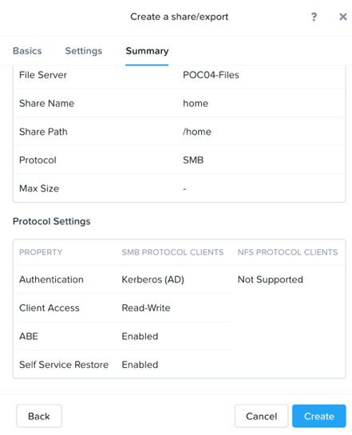
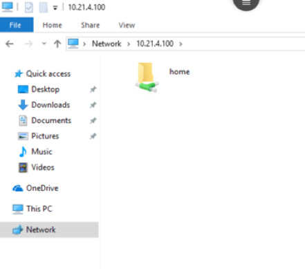

.. _files_deploy:

------------------------
ACROPOLIS FILE SERVICES
------------------------

Overview
++++++++

.. note::

  Estimated time to complete: **1 HOUR**

In this exercise you will use Prism to deploy Files, a native, distributed file server solution for Nutanix clusters. You will configure SMB share, and familiarize yourself with new features of the AFS offering.

In following steps, you may replace ‘xx’ with your assigned cluster ID

Networks preparation
+++++++++++++++++++++

Launch a web browser and log into POC0xx-ABC PRISM with IP 10.21.xx.37, User: admin, Password: techX2019!

Firstly, we need to make sure a primary and a secondary network are created for File Service. 

Click gear icon on top right to access configuration page and navigate to Network Configuration. Click **+Create Network** in **Virtual Networks** tab.

- create ‘Rx-Automation-Network’ with VLAN 0
 
- create vlan x (see Reservation Information) named Secondary 

then click **save**

.. image:: images/image001.png

  
Create AD VM for AD/LDAP connectivity
+++++++++++++++++++++++++++++++++++++++++

In **Prism>Storage** , create a Storage Container called *Images* if there is no existing one of that name.

Open a terminal and SSH to CVM, type ‘ssh nutanix@10.21.xx.31’ , type ‘ yes’ and enter CVM credentials then access to acli command line

*acli image.create AutoDC container=Images image_type=kDiskImage source_url=http://10.21.250.221/images/auto_dc.qcow2*

  
Now we are going to create an AD VM from image AutoDC. AD is a pre-requirement of File Service.

In **Prism > VM**, click **+ Create VM**

   
click **+ Add New Disk** , choose **Clone from Image Service** and image ‘AutoDC’，click **Add**.

.. image:: images/image005.png

Click **+Add new NIC** and choose **Rx-Automation-Network** vlan.0, click **Add**.

 
After AD VM is created successfully, power on AD VM, then launch console to see domain name, IP Address and credentials of AD. This information will be used later.

Deploy Acropolis File Services
++++++++++++++++++++++++++++++

In **Prism > File Server**, click **+ File Server**.

Firstly, download Files 3.1.0.1 package, click Continue to install File Services Software on POCxx
Secondly, add Data Services IP as 10.21.XX.38. Click Continue.

Fill out the following fields and click **Next**:

- **Name** - *intials*-Files (e.g. POCxx-Files)
- **Domain** - POCLAB.local
- **File Server Size** - 1 TiB
  

Select the **Rx-Automation-Network-Unmanaged** VLAN for the Client Network. Specify your cluster's **AutoDC** VM IP as the **DNS Resolver IP**. Click **Next**.

.. note::

  In order for the Files cluster to successfully find and join the **POCLAB.local** domain it is critical that the **DNS Resolver IP** is set to the **AD** VM IP **FOR YOUR CLUSTER**. By default, this field is set to the primary **Name Server** IP configured for the Nutanix cluster, **this value is incorrect and will not work**.

Fill out the following fields and click **Next**:

- **Subnet Mask** – 255.255.255.128
- **Gateway** – 10.21.xx.1
- **IP** – **from** 10.21.xx.100 **to** 10.21.xx.102 (click **save** on the right)
- **DNS** – 10.21.xx.yy (AD VM IP address)
- **NTP** – 10.21.253.10

.. note::

 AFS requires n (n, being the number of FSVMs) IP addresses on the Client network: 1 IP address per FSVM.

Select the **Secondary - Managed** VLAN for the Storage Network. Click **Next**.

Fill out the following fields and click **Next**:

- **Subnet Mask** – 255.255.255.128
- **Gateway** – 10.21.xx.129
- **IP** – **from** 10.21.xx.132 **to** 10.21.xx.135 (click **save** on the right)

.. note::
  
  AFS requires n+1 (n, being the number of FSVMs) IP addresses on the Storage network: 1 IP address per FSVM and 1 IP address for the CVMs to reach the FSVM cluster. This additional IP address is a floating highly available IP address. These IP addresses should not overlap with the IP addresses on the Client network.
  It is typically desirable to deploy Files with dedicated networks for client and storage. By design, however, Files does not allow client connections from the storage network in this configuration.

Fill out the following fields and click **Next**:

- Select **Use SMB Protocol**
- **Username** - Administrator@POCLAB.local
- **Password** - nutanix/4u
- Select **Make this user a File Server admin**
- Select **Use NFS Protocol**
- **User Management and Authentication** - Unmanaged

Fill out the following fields and click **Create**:

- Select **Create a Protection Domain and a default schedule (highly recommended)**
- **PROTECTION DOMAIN NAME** - NTNX-POCxx-Files

Monitor deployment progress in **Prism > Tasks**.

.. note::

  If you receive a warning regarding DNS record validation failure, this can be safely ignored. The shared cluster does not use the same DNS servers as your Files cluster, and as a result is unable to resolve the DNS entries created when deploying Files.

Upon completion, select the **AFS** server and click **Protect**. Click **+Add schedule** to make a snapshot schedule you plan.

Observe the default Self Service Restore schedules, this feature controls the snapshot schedule for Windows' Previous Versions functionality. Supporting Previous Versions allows end users to roll back changes to files without engaging storage or backup administrators. Note these local snapshots do not protect the file server cluster from local failures and that replication of the entire file server cluster can be performed to remote Nutanix clusters. Click **Close**.

Configuring SMB Home Share
+++++++++++++++++++++++++++

In **Prism** > **File Server**, click **+Share/Export**. 

Fill out the following fields and click Next:
- **Name** – home
- **File Server**- POCxx-Files
- **Select Protocol** - SMB
 

Select **Enable Access Based Enumeration (ABE)**, **Self Service Restore** and **Advanced Settings**. Select **Home directory and User Profiles** and click **next**

 
Review Summary tab and click **create**
 

Login to https://citrixready.nutanix.com using your supplied credentials
Select "Customers, Partners & Bootcamps" to access your virtual desktop, open file browser and type ‘\\10.21.xx.100’ (or any other IP of FSVM)
Login by administrator@poclab.local credential 

 
You can see home share after login successfully.

 

Takeaways
+++++++++

- Nutanix provides file services suitable for storing user profiles and application data via SMB or NFSv4.
- AFS is capable of scaling up and out to meet workload requirements.
- AFS has data protection built-in by leveraging native snapshots and replication. AFS 3.0 also feature integration with 3rd party backup solutions.
